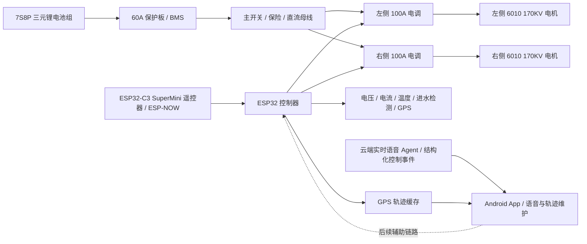

# 系统总览

## 目标

构建一套用于智能桨板的双推进电控系统。第一阶段先完成安全可控的推进控制闭环：可靠上电、解锁、油门输出、失联保护、低电压保护和基础遥测。

## 高层架构

## 推荐迭代顺序

1. 建立固件工程和双 ESC PWM 输出，保持上电锁定。
2. 加入电池电压采样、ESC/电池温度采样和日志输出。
3. 加入遥控输入，并实现失联保护。
4. 做岸上限流低功率测试，确认解锁、油门曲线、急停、故障降功率。
5. 做水下低功率测试，记录 ESC 灌胶后温升。
6. 再逐步提高功率，并修正散热、线束和结构。

## 当前关键假设

- ESC 按双向 RC PWM 信号处理：约 1000us 最大后退、1500us 中位/空闲、2000us 最大前进。实际以电调说明书和低功率实测为准。
- 第一版实时遥控链路改为 ESP32-C3 SuperMini 遥控器通过 ESP-NOW 直连主控，命令格式、绑定方式和失联保护见 [ESP-NOW 遥控 MVP](espnow_control_mvp.md)。
- Android 云端实时语音 Agent 只作为低速辅助输入，方案和限幅规则见 [Android 云端实时语音 Agent 方案](voice_control_plan.md)；语音链路不作为第一版主遥控心跳。第一版暂不使用本地 Qwen ASR，采用用户显式启动的按住说话或实时对话云端音频流。
- 航向锁定和角度转向的快速闭环由 ESP32 固件执行，避免手机链路延迟和控制频率不足影响动态反打。Android App 只负责记录/更新目标航向、基础推力、限幅参数和控制心跳，不再在锁航激活时本地计算最终左右 ESC 功率。固件在 `20ms` PWM 控制周期内读取主控 IMU 航向 `YBY` 和角速度 `YBGZ`，计算航向误差、PD 阻尼和预测反打，再输出左右 ESC。固件锁航要求 `YBIMU=1` 且航向/角速度新鲜有效；手机指南针只能作为 Android 地图显示、人工参考或后续低速上层目标来源，不能参与固件快速反打闭环。Android 和 ESP32 不能同时对同一锁航任务计算最终 `L/R`。
- 空档原地掉头时，ESP32 固件使用动态正反推差值：航向误差超过容差后，左右总差值随误差从默认 `20%` 增加到 `60%`，可由 Android 设置页下发参数；`20%` 总差值约等于单侧 `10%`，用于避开当前电机起转死区。该逻辑只作用于空档锁航/角度转向，非空档锁航仍使用固件差速修正。非空档基础推力绝对值低于 `70%` 时，转向修正允许慢侧跨过 `0%` 进入反推；基础推力达到或超过 `70%` 时，仍禁止主动反推，慢侧到 `0%` 后牺牲部分差速，避免高推力下突然反向。
- 持续航向锁定带 3 秒误差窗口自适应补偿：同向误差长期不收敛时逐步增加差速，误差同向改善但仍未进容差时保持补偿，误差回到容差或变号时自动衰减，补偿上限为额外 `20%` 且仍受最终输出限幅保护；如果误差在约 `3s` 内同向扩大超过 `8°`，ESP32 固件立即取消锁航、锁定并回空挡。
- 航向锁定需要增加提前反向力以抑制转向惯性过冲：固件优先使用主控 IMU `YBGZ` 或航向变化率预测短时间后的误差，预测会过冲时提前给反向差速；控制论设计见 [航向锁定工程控制论设计](heading_lock_cybernetic_control_design.md)，参数和测试细节见 [航向锁定提前反向力方案](heading_lock_anti_overshoot_plan.md)。
- ICM20948 融合航向作为中期影子航向源推进，先在 ESP32 上融合陀螺仪、加速度计和磁力计并上报给 Android 对比，不参与默认控制闭环；方案见 [ICM20948 融合航向中期方案](imu_fusion_heading_plan.md)。
- GPS 第一版只用于实时定位、1Hz 轨迹缓存、Android 同步和历史回放，不参与推进安全闭环；方案见 [GPS 实时定位、轨迹记录和回放方案](gps_track_plan.md)。
- 自动导航第一版仍只在 Android App 中保存路线和规划目标，不让 ESP32 独立保存或执行路线；涉及快速航向稳定的内环由 ESP32 固件锁航控制器执行，Android 只下发目标航向、基础推进和受限控制心跳。方案见 [自动导航路线和执行方案](auto_navigation_plan.md)。
- 每个 ESP32 的三位硬件编号在出厂第一次 USB 刷入时写入 NVS/flash，流程见 [ESP32 出厂编号刷入流程](esp32_factory_provisioning.md)。
- Android App 和 ESP32 固件更新走 GitHub Release，流程见 [GitHub 更新发布流程](update_release_flow.md)。
- 两个 100A ESC 不应由 60A BMS 长时间满功率供电，系统持续功率需要按 BMS、线束、电芯放电能力和散热重新核算。
- ESP32 与 ESC 信号地需要可靠共地；ESC BEC 是否给 ESP32 供电需单独验证，优先使用独立降压模块。
