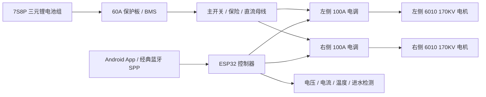

# 系统总览

## 目标

构建一套用于智能桨板的双推进电控系统。第一阶段先完成安全可控的推进控制闭环：可靠上电、解锁、油门输出、失联保护、低电压保护和基础遥测。

## 高层架构

## 推荐迭代顺序

1. 建立固件工程和双 ESC PWM 输出，保持上电锁定。
2. 加入电池电压采样、ESC/电池温度采样和日志输出。
3. 加入遥控输入，并实现失联保护。
4. 做岸上限流低功率测试，确认解锁、油门曲线、急停、故障降功率。
5. 做水下低功率测试，记录 ESC 灌胶后温升。
6. 再逐步提高功率，并修正散热、线束和结构。

## 当前关键假设

- ESC 按双向 RC PWM 信号处理：约 1000us 最大后退、1500us 中位/空闲、2000us 最大前进。实际以电调说明书和低功率实测为准。
- Android 控制端第一版使用经典蓝牙 SPP，命令和失联保护见 [经典蓝牙控制 MVP](bluetooth_control_mvp.md)。
- Android App 和 ESP32 固件更新走 GitHub Release，流程见 [GitHub 更新发布流程](update_release_flow.md)。
- 两个 100A ESC 不应由 60A BMS 长时间满功率供电，系统持续功率需要按 BMS、线束、电芯放电能力和散热重新核算。
- ESP32 与 ESC 信号地需要可靠共地；ESC BEC 是否给 ESP32 供电需单独验证，优先使用独立降压模块。
