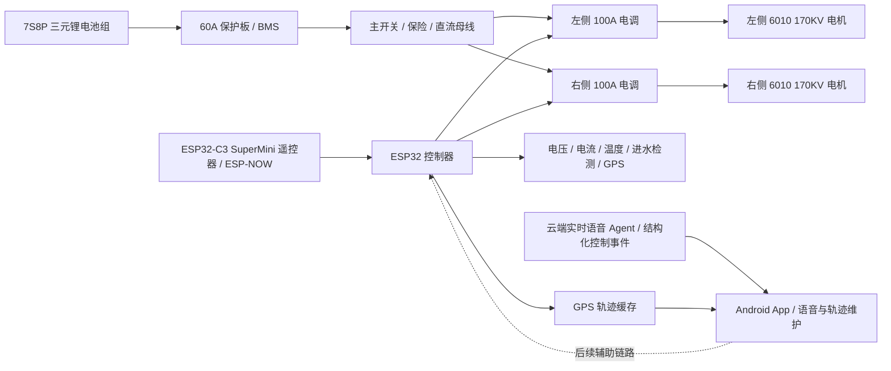

# 系统总览

## 目标

构建一套用于智能桨板的双推进电控系统。第一阶段先完成安全可控的推进控制闭环：可靠上电、解锁、油门输出、失联保护、低电压保护和基础遥测。

## 高层架构

## 推荐迭代顺序

1. 建立固件工程和双 ESC PWM 输出，保持上电锁定。
2. 加入电池电压采样、ESC/电池温度采样和日志输出。
3. 加入遥控输入，并实现失联保护。
4. 做岸上限流低功率测试，确认解锁、油门曲线、急停、故障降功率。
5. 做水下低功率测试，记录 ESC 灌胶后温升。
6. 再逐步提高功率，并修正散热、线束和结构。

## 当前关键假设

- ESC 按双向 RC PWM 信号处理：约 1000us 最大后退、1500us 中位/空闲、2000us 最大前进。实际以电调说明书和低功率实测为准。
- 第一版实时遥控链路改为 ESP32-C3 SuperMini 遥控器通过 ESP-NOW 直连主控，命令格式、绑定方式和失联保护见 [ESP-NOW 遥控 MVP](espnow_control_mvp.md)。
- Android 云端实时语音 Agent 只作为低速辅助输入，方案和限幅规则见 [Android 云端实时语音 Agent 方案](voice_control_plan.md)；语音链路不作为第一版主遥控心跳。第一版暂不使用本地 Qwen ASR，采用用户显式启动的按住说话或实时对话云端音频流。
- App 只描述用户或上层导航“要做什么”，主控负责“具体怎么做”。例如 App 可以下发前进档位、`MODE=TURN;DIR=LEFT;ANGLE=45`、固件锁航 `TARGET/BASE` 或自动导航目标航向，但航向误差闭环、转向差速、短时扰动补偿、预测反打、限幅和最终左右 ESC 输出只能由 ESP32 固件实现。
- 左右 ESC 方向反转是安装/出厂配置，不属于上层控制算法参数。该配置通过 `ESC_CFG;LREV=...;RREV=...` 写入 ESP32 主控 NVS；Android App 只能在安装/维护设置中写入该配置，不能在控制算法里读取或应用它。固件闭环算法全程只使用用户语义方向：`L/R` 表示前进为正、后退为负；只有最终 PWM 输出层才能把语义推进百分比按 NVS 反向配置映射到实际 ESC 信号。控制状态和控制日志不得暴露底层反向后的 raw 输出。
- 航向锁定、角度转向、自动导航航向修正和定点保持朝向修正共用 ESP32 固件里的同一套航向转向内环。Android App 只负责记录/更新目标航向、基础推力、限幅参数、航向源和控制保活，不在本地计算最终左右 ESC 功率。锁航启动、取消或目标/基础推力变化时发送 `MODE=HEADING_LOCK` 事件；锁航保持期间只发送 `MODE=KEEPALIVE` 保活，避免重复启动命令干扰主控内环状态。固件在 `20ms` PWM 控制周期内使用当前选择的航向源闭环：默认主控 IMU `YBHDG/YBGZ`；手机模式由 Android 发送校准后的 `PHDG`，固件用连续 `PHDG` 差分估计航向角速度。最终差速、扰动补偿、预测反打、限幅和左右 ESC 输出仍全部由 ESP32 固件计算。
- Android 进入固件锁航前必须确认当前设置的航向源有效。主控 IMU 模式要求 ESP32 回传 `HSRC=YBIMU`，并用 `YBINIT/YBAGE/YBHDG` 诊断字段确认主控航向已初始化且样本未超时；手机模式要求手机固定在桨板上、相对船体方向不变，并持续上报 `H_SRC=PHONE;PHDG=...`。启动锁航时，Android 必须用同一次航向源快照填入首条 `MODE=HEADING_LOCK` 的 `TARGET` 和手机模式下的 `PHDG`，避免 App 显示目标与主控启动目标来自两次采样。手机航向超过 `1.5s` 无有效更新时，Android 控制页必须把手机指南针标为等待读数，ESP32 停止继续放大差速并等待新航向，但不因普通超时自动取消用户锁航目标；Android 同时显示系统传感器精度状态，用于判断手机指南针是否受磁干扰或系统融合不可信。
- 空档原地掉头时，ESP32 固件使用动态正反推差值：航向误差超过容差后，左右差速修正先跨过当前电机起转死区，再随持续误差和角速度误差增大。当前锁航/转向最终语义输出采用非对称限幅：正推最高 `70%`，反推最高 `60%`；Android 设置页下发的 `HREV` 表示空档单侧最大反推百分比，旧 App 发送过低时主控按当前最低测试上限 `60%` 提升为有效值。该逻辑只作用于空档锁航/角度转向，非空档锁航仍使用固件差速修正。非空档基础推力绝对值低于 `70%` 时，转向修正允许慢侧跨过 `0%` 进入反推；基础推力达到或超过 `70%` 时，仍禁止主动反推，慢侧到 `0%` 后牺牲部分差速，避免高推力下突然反向。
- 持续航向锁定只允许当前会话短时扰动补偿：ESP32 根据目标角速度和实际航向角速度的持续差值积分出 `HBOOST`，让“有差速但转动量不足”的场景自动增加差速，用来补偿水流、风、电池电压、电机非线性和原地死区造成的短时残差；主控 IMU 模式优先使用 `YBGZ`，手机模式使用连续 `PHDG` 的最短角度差分。误差超过容差但仍处在安静保持带内、角速度很低且持续超过短延迟时，固件进入 `HPHASE=CREEP` 小残差慢积分，用 `HCREEP` 按很小斜率补入 `HBOOST`，让 2-3° 长时间残差也能逐步加一点差速；回到容差内、进入刹车、发散保护或航向源异常时该小积分衰减/清零。主控 Yahboom IMU 的 `YBHDG` 采用 `YBGZ` 陀螺短期积分跟随，并用模块原始 `YBY + 180°` 得到的 `YBRAWHDG` 慢速校正，避免绝对 yaw 在电机磁干扰或模块融合异常时短时间卡住。该补偿不写入 NVS，不跨水域/风向记忆，退出锁航、角度转向完成、用户取消、蓝牙断开、航向源异常或误差收敛时衰减/清零。补偿状态通过 `HBOOST/HFHAT/HCREEP` 回传且仍受最终输出限幅保护；如果误差持续同向扩大且船头仍在远离目标方向转动，ESP32 固件回传 `HWARN=HEADING_LOCK_DIVERGED`，临时冻结 `HBOOST` 和转向修正，输出回到基础推力；一旦船头停止远离目标或开始回目标，清零 `HBOOST` 后自动恢复差速修正，不自动退出锁航或发 `HLOCK=OFF`。
- 航向锁定需要增加提前反向力以抑制转向惯性过冲：固件优先使用主控 IMU `YBGZ` 或航向变化率预测短时间后的误差，预测会过冲时提前给反向差速；控制论设计见 [航向锁定工程控制论设计](heading_lock_cybernetic_control_design.md)，参数和测试细节见 [航向锁定提前反向力方案](heading_lock_anti_overshoot_plan.md)。
- ICM20948 融合航向作为中期影子航向源推进，先在 ESP32 上融合陀螺仪、加速度计和磁力计并上报给 Android 对比，不参与默认控制闭环；方案见 [ICM20948 融合航向中期方案](imu_fusion_heading_plan.md)。
- GPS 第一版只用于实时定位、1Hz 轨迹缓存、Android 同步和历史回放，不参与推进安全闭环；方案见 [GPS 实时定位、轨迹记录和回放方案](gps_track_plan.md)。
- 自动导航第一版仍只在 Android App 中保存路线和规划目标，不让 ESP32 独立保存或执行路线；Android 只把路线规划结果表达为目标航向、基础推进和受限控制心跳，快速航向稳定内环由 ESP32 固件统一执行。方案见 [自动导航路线和执行方案](auto_navigation_plan.md)。
- 每个 ESP32 的三位硬件编号在出厂第一次 USB 刷入时写入 NVS/flash，流程见 [ESP32 出厂编号刷入流程](esp32_factory_provisioning.md)。
- Android App 和 ESP32 固件更新走 GitHub Release，流程见 [GitHub 更新发布流程](update_release_flow.md)。
- 两个 100A ESC 不应由 60A BMS 长时间满功率供电，系统持续功率需要按 BMS、线束、电芯放电能力和散热重新核算。
- ESP32 与 ESC 信号地需要可靠共地；ESC BEC 是否给 ESP32 供电需单独验证，优先使用独立降压模块。
