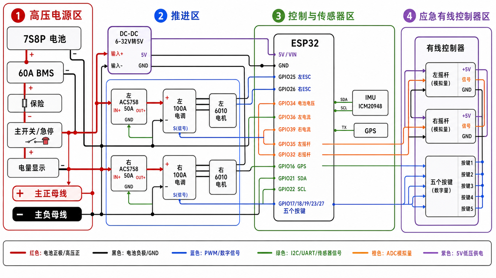

# 详细接线图

## 清爽版

## 可编辑草图版

[SVG 草图](./wiring_diagram.svg)

## 当前引脚分配

| 功能 | ESP32 引脚 |
| --- | --- |
| 左 ESC PWM | GPIO26 |
| 右 ESC PWM | GPIO25 |
| 电池电压 ADC | GPIO34 |
| 左电流 ADC | GPIO36 |
| 右电流 ADC | GPIO39 |
| 左摇杆 ADC | GPIO35 |
| 右摇杆 ADC | GPIO32 |
| GPS RX2 | GPIO16 |
| GPS PPS | GPIO13 |
| IMU SDA | GPIO14 |
| IMU SCL | GPIO22 |
| 加档 | GPIO17 |
| 减档 | GPIO18 |
| 回到空档 | GPIO19 |
| 方向锁定 | GPIO23 |
| 状态 LED | GPIO2 |

## 接线重点

当前线束接法下，固件最低 PWM 输出层已把逻辑左/右 ESC GPIO 对调：逻辑左通道走 `GPIO26`，逻辑右通道走 `GPIO25`。这只修正左右通道映射，不等同于 `LREV/RREV` 前后方向反转。

- ESP32 只能由 DC-DC 的 5V 输出供电，接 `5V` 或 `VIN`，不要把 7S 电池直接接到 ESP32。
- 所有低压模块的 `GND` 必须与电池负极、ESC 信号地共地。
- ACS758 电流传感器串在 ESC 的直流输入正极支路，不接电机三相线。
- 电池电压进入 ESP32 ADC 前必须分压，GPIO34 不能直接接 7S 电池总压。
- 有线控制器不提供解锁按键，插入后不能自动启动电机。
